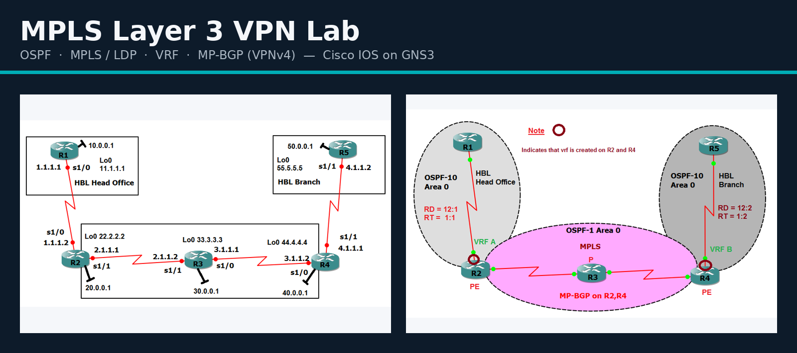
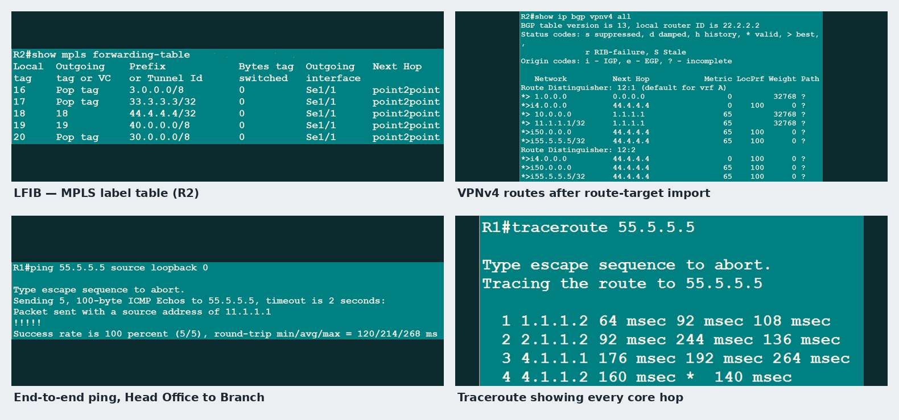

<div align="center">



<br><br>

[](https://github.com/ahmedabbas-khan/mpls-layer3-vpn-lab/actions/workflows/validate.yml)


**Two customer sites, one shared provider core, zero leaked routes.**
A five-router MPLS Layer 3 VPN, fully configured, documented, and self-checking.

[Quick start](#-quick-start) · [Docs](#-documentation) · [Configs](configs/) · [Study notes (.docx)](docs/Study-Notes-MPLS-L3VPN.docx)

</div>

<br>

## 📡 What this is

HBL **Head Office** (R1) and HBL **Branch** (R5) talk to each other privately across a provider network they don't own. The provider core (R2 – P – R4) forwards every packet purely by **MPLS label** — it never learns a single customer route. Each site's routes live in their own **VRF**, kept apart by a Route Distinguisher and stitched back together across the core by **MP-BGP (VPNv4)**.

| | Router | Role | Runs |
|---|--------|------|------|
| 🖥️ | **R1** | CE — Head Office | OSPF 10 |
| 🔁 | **R2** | PE — owns VRF A | OSPF 1 · MPLS/LDP · VRF A · OSPF 10 in VRF · MP-BGP |
| ⚙️ | **R3** | P — core only | OSPF 1 · MPLS/LDP — **no VRF, no BGP** |
| 🔁 | **R4** | PE — owns VRF B | OSPF 1 · MPLS/LDP · VRF B · OSPF 10 in VRF · MP-BGP |
| 🖥️ | **R5** | CE — Branch | OSPF 10 |

<details>
<summary><b>Why it's built this way</b> (click to expand)</summary>
<br>

- **Privacy** — each site's routes sit in their own VRF, tagged with a unique Route Distinguisher, so two customers could reuse the same IP range without ever colliding.
- **A lean core** — R3 forwards purely by MPLS label and never touches a customer address. Proven hop-by-hop in [`docs/04-verification.md`](docs/04-verification.md).
- **Controlled reachability** — sites reach each other only because their VRFs explicitly **import** each other's Route Target. Nothing crosses by accident.

</details>

<br>

## 🖼️ It actually works — see for yourself



<sub>Every step has its own labelled screenshots in [`docs/03-configuration-guide.md`](docs/03-configuration-guide.md) and a full hop-by-hop packet trace in [`docs/04-verification.md`](docs/04-verification.md).</sub>

<br>

## 🚀 Quick start

<details open>
<summary><b>Load it in GNS3 / Cisco IOS</b></summary>
<br>

1. Build the topology above (five routers, cabling in [`docs/02-design-and-addressing.md`](docs/02-design-and-addressing.md)).
2. Paste each router's config from [`configs/`](configs/):

   ```
   enable
   configure terminal
   <paste the matching R*.cfg>
   end
   write memory
   ```
3. Give OSPF, LDP and BGP a minute to converge.
4. Verify:
   ```
   R1#ping 55.5.5.5 source Loopback0
   R5#ping 11.1.1.1 source Loopback0
   ```
   Both should return **100 percent**.

</details>

<details>
<summary><b>Validate the files yourself</b></summary>
<br>

```bash
python tools/validate_configs.py
```
Checks every interface address against `configs/addressing.csv`, confirms both ends of every link agree, and checks R2/R4's BGP and VRF settings are consistent — R3 included, to prove it stays clean. Runs automatically on every push via GitHub Actions.

</details>

<br>

## 📚 Documentation

| Guide | What's in it |
|---|---|
| [`01-concepts.md`](docs/01-concepts.md) | MPLS VPN theory from zero — CE/PE/P, RD, RT, MP-BGP, with a courier analogy |
| [`02-design-and-addressing.md`](docs/02-design-and-addressing.md) | Topology, full addressing table, OSPF cost math |
| [`03-configuration-guide.md`](docs/03-configuration-guide.md) | All 10 steps — commands + expected output, screenshotted |
| [`04-verification.md`](docs/04-verification.md) | One packet traced hop by hop, label by label |
| [`05-troubleshooting.md`](docs/05-troubleshooting.md) | Symptom → command to check → likely cause |
| [`06-command-reference.md`](docs/06-command-reference.md) | Every command used, grouped, one line each |
| [`07-command-corrections.md`](docs/07-command-corrections.md) | Fixes to the original lab sheet's broken commands |
| [`08-study-guide.md`](docs/08-study-guide.md) | Cheat sheet, common mistakes, practice Q&A |
| [`Study-Notes-MPLS-L3VPN.docx`](docs/Study-Notes-MPLS-L3VPN.docx) | The same material, fully illustrated, as a Word document |

<br>

## 🗂️ Repository layout

<details>
<summary>Expand full tree</summary>

```
mpls-layer3-vpn-lab/
├── configs/              Final router configs, ready to paste (R1–R5, addressing.csv)
├── docs/                 9 guides — concepts to command reference — + Word write-up
├── images/                Topology diagrams + 48 labelled output screenshots
├── tools/
│   └── validate_configs.py   Checks addressing, configs, BGP and VRF design
└── .github/workflows/     CI: runs the validator on every push
```

</details>

<br>

## 🛠️ Tools used

Cisco IOS · GNS3 · Python 3 · GitHub Actions

<br>

---

<div align="center">
<sub>Built and documented by <b>Ahmed Abbas</b> — IT student (Networking), Bahauddin Zakariya University, Multan.<br>
Part of a personal Cisco lab portfolio, alongside <a href="https://github.com/ahmedabbas-khan/cisco-secure-acs-aaa-lab">cisco-secure-acs-aaa-lab</a> and <a href="https://github.com/ahmedabbas-khan">intro-to-networking-labs</a>.</sub>
<br><br>
Licensed under <a href="LICENSE">MIT</a> — free to use for learning or teaching, with attribution appreciated.
</div>
