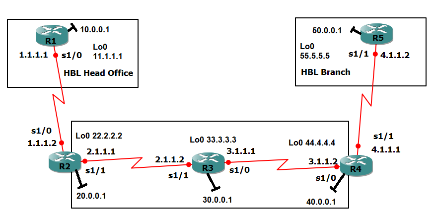
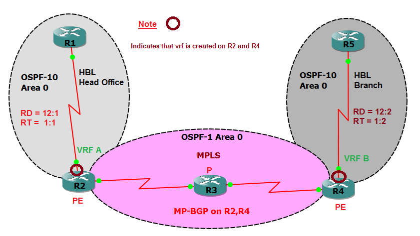

# 2. Design and addressing

## Topology

Physical view: cables, interface names and IP addresses.

Logical view: which protocol runs where, plus the VRFs, RD and RT values.

How to read the logical picture:

* The two **grey bubbles** are the customers. The **pink oval** is the provider (OSPF 1 plus MPLS).
* The **red ring** on R2 and R4 means "a VRF is created here".
* The text next to each customer (`RD = 12:1`, `RT = 1:1`) are the values configured in step 5.3.

## Cabling

| Link | Router A port | Router B port | Network |
|------|---------------|---------------|---------|
| Customer 1 to PE | R1 Serial1/0 | R2 Serial1/0 | 1.0.0.0/8 |
| Core link 1 | R2 Serial1/1 | R3 Serial1/1 | 2.0.0.0/8 |
| Core link 2 | R3 Serial1/0 | R4 Serial1/0 | 3.0.0.0/8 |
| PE to Customer 2 | R4 Serial1/1 | R5 Serial1/1 | 4.0.0.0/8 |

## Addressing plan

Every link and LAN uses a /8 mask (255.0.0.0). Every loopback uses a /32 mask (255.255.255.255). The same data lives in [`configs/addressing.csv`](../configs/addressing.csv).

| Router | Role | Loopback0 | FastEthernet0/0 | Serial ports |
|--------|------|-----------|-----------------|--------------|
| R1 | CE, Head Office | 11.1.1.1 | 10.0.0.1 | S1/0 1.1.1.1 (to R2) |
| R2 | PE, VRF A | 22.2.2.2 | 20.0.0.1 | S1/0 1.1.1.2 (to R1, in VRF A) S1/1 2.1.1.1 (to R3) |
| R3 | P router | 33.3.3.3 | 30.0.0.1 | S1/1 2.1.1.2 (to R2) S1/0 3.1.1.1 (to R4) |
| R4 | PE, VRF B | 44.4.4.4 | 40.0.0.1 | S1/0 3.1.1.2 (to R3) S1/1 4.1.1.1 (to R5, in VRF B) |
| R5 | CE, Branch | 55.5.5.5 | 50.0.0.1 | S1/1 4.1.1.2 (to R4) |

## Which protocol runs where

| Zone | Protocol | Routers | Networks |
|------|----------|---------|----------|
| Provider core | OSPF process 1, area 0 | R2, R3, R4 | 2.0.0.0, 3.0.0.0, 20.0.0.0, 30.0.0.0, 40.0.0.0 and the three loopbacks |
| Customer 1 (Head Office) | OSPF process 10, area 0 | R1, and R2 inside VRF A | 1.0.0.0, 10.0.0.0, 11.1.1.1 |
| Customer 2 (Branch) | OSPF process 10, area 0 | R5, and R4 inside VRF B | 4.0.0.0, 50.0.0.0, 55.5.5.5 |
| Between the PEs | MP-BGP, AS 10 (iBGP) | R2 and R4 loopbacks | VPNv4 routes for both customers |

Both customers use "OSPF 10". That is fine. An OSPF process number is only a local name on one router. Customer 1 and Customer 2 never meet in the same routing table.

## VRF design

| Setting | VRF A (R2) | VRF B (R4) |
|---------|-----------|-----------|
| Customer | HBL Head Office | HBL Branch |
| Route Distinguisher | 12:1 | 12:2 |
| Exports route-target | 1:1 | 1:2 |
| Imports route-targets | 1:1 and 1:2 | 1:2 and 1:1 |
| Customer facing port | R2 Serial1/0 | R4 Serial1/1 |
| PE to CE routing | OSPF 10 in the VRF | OSPF 10 in the VRF |

The import lines are what make the two sites see each other. Until step 5.8, each VRF accepts only its own tag.

## Design decisions and the reason for each

| Decision | Reason |
|----------|--------|
| Customer links 1.0.0.0 and 4.0.0.0 are **not** in OSPF 1 | Customer networks must stay out of the core. Only the VRFs carry them |
| R3 has no VRF and no BGP | A P router only swaps labels. This proves the core stays customer free |
| LDP router ID and BGP source are loopbacks | Stable identity that never goes down with a single cable |
| BGP is iBGP (same AS 10) between the PEs | Both PEs belong to the same provider |
| Redistribution runs both ways on each PE | OSPF into BGP sends local customer routes across. BGP into OSPF hands the far site's routes to the local CE |
| Different RD per VRF, different RT per customer | RD keeps routes unique. RT controls who can import them |

## OSPF cost in the core

OSPF cost is a score, and lower is better. A serial link at 1.544 Mbps costs **64**. FastEthernet and loopbacks cost **1**. The metric of a route is the sum of the link costs on the way.

| Route on R2 | Metric | How it is built |
|-------------|--------|-----------------|
| 33.3.3.3/32 (R3 loopback) | 65 | 64 (serial to R3) + 1 (loopback) |
| 30.0.0.0/8 (R3 LAN) | 65 | 64 + 1 (FastEthernet) |
| 3.0.0.0/8 (R3 to R4 link) | 128 | 64 + 64 (two serial links) |
| 44.4.4.4/32 (R4 loopback) | 129 | 64 + 64 + 1 |
| 40.0.0.0/8 (R4 LAN) | 129 | 64 + 64 + 1 |

Memory trick: **serial = 64, everything fast = 1.** Count the serial hops, multiply by 64, then add 1 at the end.
