# 3. Step by step configuration guide

Ten steps, done in this order. Each step lists the goal, the commands for every router involved, and what you should see afterwards. The finished configs are in [`configs/`](../configs/) if you prefer to paste whole files.

Memory sentence for the nine building steps (first letters in order):

> **O**ur **M**odern **V**illa **A**lways **O**ffers **B**ig **R**ooms **I**n **R**eserve

OSPF core, MPLS, VRF create, Assign VRF, OSPF customers, BGP, Redistribute into BGP, Import RT, Redistribute into OSPF.

| Step | What we do | Routers | Why |
|------|-----------|---------|-----|
| 5.0 | Assign IP addresses to every port | R1 to R5 | Routers cannot talk without addresses |
| 5.1 | OSPF 1 in the provider core | R2, R3, R4 | PEs and P must reach each other's loopbacks |
| 5.2 | Turn on MPLS and LDP | R2, R3, R4 | Core forwards by labels |
| 5.3 | Create VRFs with RD and RT | R2 (A), R4 (B) | One private table per customer |
| 5.4 | Put customer facing ports into the VRFs | R2, R4 | Customer traffic uses its own table |
| 5.5 | OSPF 10 between CE and PE | R1 to R2, R5 to R4 | Each PE learns its customer's routes |
| 5.6 | MP-BGP between the PEs | R2, R4 | A road to carry VPN routes |
| 5.7 | Redistribute OSPF 10 into BGP | R2, R4 | Put customer routes on that road |
| 5.8 | Import each other's route-target | R2, R4 | Head Office and Branch accept each other's routes |
| 5.9 | Redistribute BGP into OSPF 10 | R2, R4 | CE routers learn the far side |
| 5.10 | Verify and trace one packet | All | Prove it works and see the labels |

## Step 5.0: IP addresses on every port

**Goal:** give every interface its address and switch it on. A router port is off by default, so an address alone is not enough. Loopbacks use /32. Everything else uses /8.

**R1**
```
Router(config)#hostname R1
R1(config)#interface Loopback0
R1(config-if)#ip address 11.1.1.1 255.255.255.255
R1(config-if)#exit
R1(config)#interface FastEthernet0/0
R1(config-if)#ip address 10.0.0.1 255.0.0.0
R1(config-if)#no shutdown
R1(config-if)#exit
R1(config)#interface Serial1/0
R1(config-if)#ip address 1.1.1.1 255.0.0.0
R1(config-if)#no shutdown
R1(config-if)#exit
```

**R2**
```
Router(config)#hostname R2
R2(config)#interface Loopback0
R2(config-if)#ip address 22.2.2.2 255.255.255.255
R2(config-if)#exit
R2(config)#interface FastEthernet0/0
R2(config-if)#ip address 20.0.0.1 255.0.0.0
R2(config-if)#no shutdown
R2(config-if)#exit
R2(config)#interface Serial1/0
R2(config-if)#ip address 1.1.1.2 255.0.0.0
R2(config-if)#no shutdown
R2(config-if)#exit
R2(config)#interface Serial1/1
R2(config-if)#ip address 2.1.1.1 255.0.0.0
R2(config-if)#no shutdown
R2(config-if)#exit
```

**R3**
```
Router(config)#hostname R3
R3(config)#interface Loopback0
R3(config-if)#ip address 33.3.3.3 255.255.255.255
R3(config-if)#exit
R3(config)#interface FastEthernet0/0
R3(config-if)#ip address 30.0.0.1 255.0.0.0
R3(config-if)#no shutdown
R3(config-if)#exit
R3(config)#interface Serial1/1
R3(config-if)#ip address 2.1.1.2 255.0.0.0
R3(config-if)#no shutdown
R3(config-if)#exit
R3(config)#interface Serial1/0
R3(config-if)#ip address 3.1.1.1 255.0.0.0
R3(config-if)#no shutdown
R3(config-if)#exit
```

**R4**
```
Router(config)#hostname R4
R4(config)#interface Loopback0
R4(config-if)#ip address 44.4.4.4 255.255.255.255
R4(config-if)#exit
R4(config)#interface FastEthernet0/0
R4(config-if)#ip address 40.0.0.1 255.0.0.0
R4(config-if)#no shutdown
R4(config-if)#exit
R4(config)#interface Serial1/0
R4(config-if)#ip address 3.1.1.2 255.0.0.0
R4(config-if)#no shutdown
R4(config-if)#exit
R4(config)#interface Serial1/1
R4(config-if)#ip address 4.1.1.1 255.0.0.0
R4(config-if)#no shutdown
R4(config-if)#exit
```

**R5**
```
Router(config)#hostname R5
R5(config)#interface Loopback0
R5(config-if)#ip address 55.5.5.5 255.255.255.255
R5(config-if)#exit
R5(config)#interface FastEthernet0/0
R5(config-if)#ip address 50.0.0.1 255.0.0.0
R5(config-if)#no shutdown
R5(config-if)#exit
R5(config)#interface Serial1/1
R5(config-if)#ip address 4.1.1.2 255.0.0.0
R5(config-if)#no shutdown
R5(config-if)#exit
```

> In step 5.4 the addresses on **R2 Serial1/0** and **R4 Serial1/1** are erased by the VRF and typed again. Typing them here first matches the original lab and shows you the warning message on purpose.
>
> On real hardware, add `clock rate 64000` on the DCE end of each serial cable. GNS3 does not need it.

**Check:**
```
R1#show ip interface brief
R1#ping 1.1.1.2
R2#ping 2.1.1.2
R3#ping 3.1.1.2
R4#ping 4.1.1.2
```
Every port should show `up / up`, and each ping should return five exclamation marks. `administratively down` means `no shutdown` was forgotten.

## Step 5.1: OSPF 1 in the provider core

**Goal:** let R2, R3 and R4 reach each other, especially their loopbacks (22.2.2.2, 33.3.3.3, 44.4.4.4). LDP and BGP will use those loopbacks as their identity. Only the provider routers run this.

```
R2(config)#router ospf 1
R2(config-router)#network 2.0.0.0 0.255.255.255 area 0
R2(config-router)#network 22.2.2.2 0.0.0.0 area 0
R2(config-router)#network 20.0.0.0 0.255.255.255 area 0
R2(config-router)#exit

R3(config)#router ospf 1
R3(config-router)#network 2.0.0.0 0.255.255.255 area 0
R3(config-router)#network 3.0.0.0 0.255.255.255 area 0
R3(config-router)#network 33.3.3.3 0.0.0.0 area 0
R3(config-router)#network 30.0.0.0 0.255.255.255 area 0
R3(config-router)#exit

R4(config)#router ospf 1
R4(config-router)#network 3.0.0.0 0.255.255.255 area 0
R4(config-router)#network 44.4.4.4 0.0.0.0 area 0
R4(config-router)#network 40.0.0.0 0.255.255.255 area 0
R4(config-router)#exit
```

How to read `network 2.0.0.0 0.255.255.255 area 0`: any interface whose address starts with 2 joins area 0. In the wildcard mask, **0 means the number must match** and **255 means "I do not care"**. The mask `0.0.0.0` on a loopback means "exactly this one address".

Notice that 1.0.0.0 and 4.0.0.0 (the customer links) are **not** here on purpose.

**Result:** `show ip route` on each router.

| Router | Screenshot | What to notice |
|--------|-----------|----------------|
| R1 | 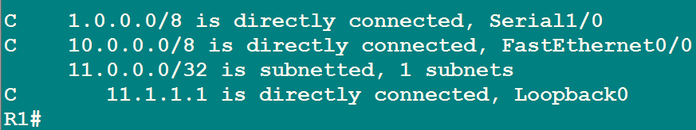 | Connected routes only. OSPF 10 is not running yet |
| R2 | 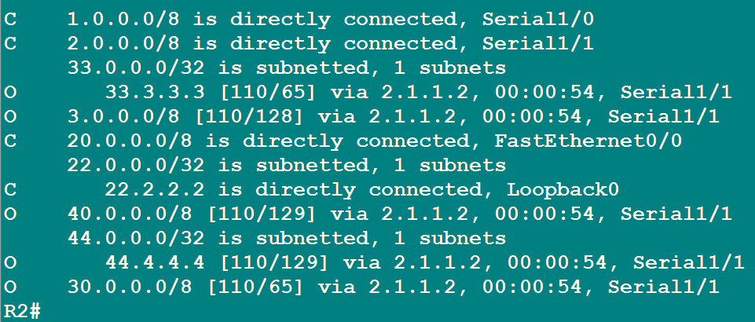 | Learns 33.3.3.3, 3.0.0.0, 30.0.0.0, 40.0.0.0, 44.4.4.4 by OSPF |
| R3 | 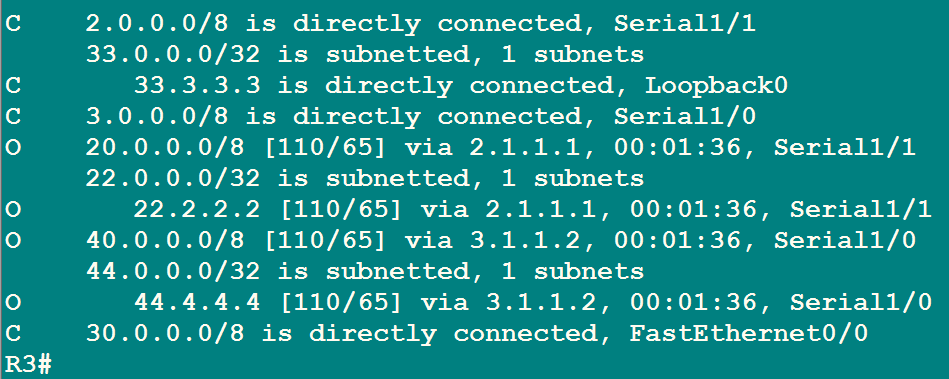 | Learns both sides of the core |
| R4 | 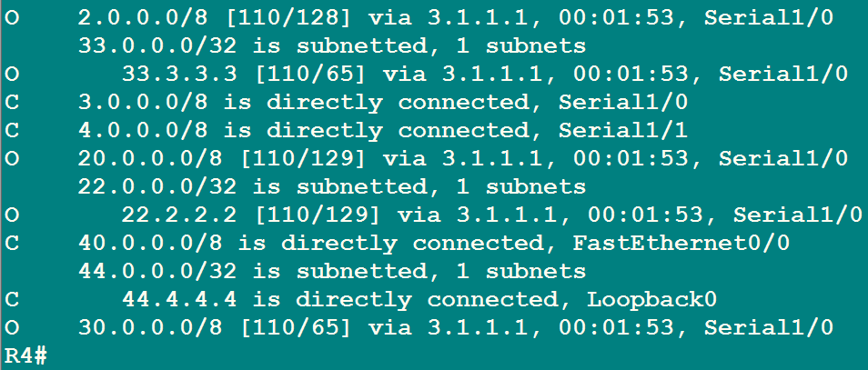 | Learns 2.0.0.0, 20.0.0.0, 22.2.2.2 and the rest |
| R5 | 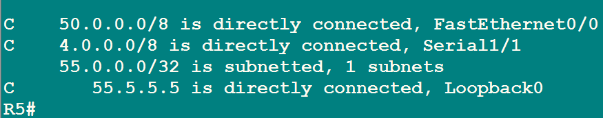 | Connected routes only |

## Step 5.2: MPLS and LDP

**Goal:** make the core forward by labels. Only the core facing ports get MPLS. The customer facing ports (R2 Serial1/0 and R4 Serial1/1) do **not**.

```
R2(config)#ip cef
R2(config)#mpls ip
R2(config)#mpls label protocol ldp
R2(config)#mpls ldp router-id Loopback0
R2(config)#interface Serial1/1
R2(config-if)#mpls ip
R2(config-if)#mpls label protocol ldp
R2(config-if)#exit

R3(config)#ip cef
R3(config)#mpls ip
R3(config)#mpls label protocol ldp
R3(config)#mpls ldp router-id Loopback0
R3(config)#interface Serial1/1
R3(config-if)#mpls ip
R3(config-if)#exit
R3(config)#interface Serial1/0
R3(config-if)#mpls ip
R3(config-if)#exit
*%LDP-5-NBRCHG: LDP Neighbor 22.2.2.2:0 (1) is UP

R4(config)#ip cef
R4(config)#mpls ip
R4(config)#mpls label protocol ldp
R4(config)#mpls ldp router-id Loopback0
R4(config)#interface Serial1/0
R4(config-if)#mpls ip
R4(config-if)#exit
*%LDP-5-NBRCHG: LDP Neighbor 33.3.3.3:0 (1) is UP
```

| Command | Plain English |
|---------|---------------|
| `ip cef` | Turns on the fast forwarding engine. MPLS needs it |
| `mpls ip` (global) | Allows label switching on the router |
| `mpls label protocol ldp` | Choose LDP to hand out labels |
| `mpls ldp router-id Loopback0` | Use the loopback as the LDP identity |
| `mpls ip` (interface) | Send and receive labels on this port |

**Result:** `show mpls forwarding-table` (the LFIB).

| R2 | R3 | R4 |
|----|----|----|
| 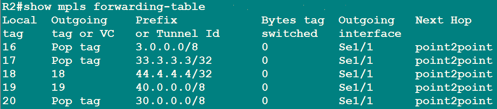 | 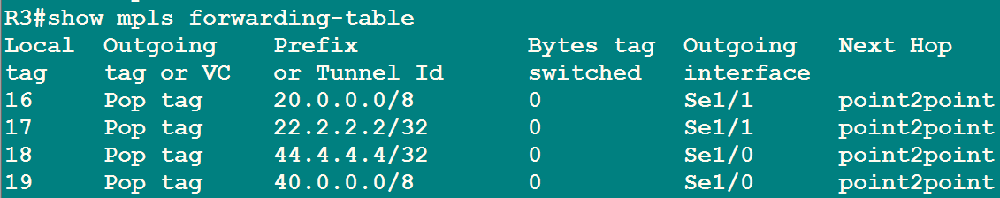 | 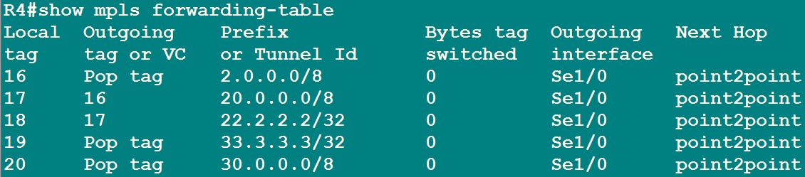 |

How to read a row: **Local tag** is the label I gave out. **Outgoing tag** is the label my neighbour gave me, and **Pop tag** means "remove the label here". **Prefix** is the destination. **Outgoing interface** is where the packet leaves.

## Step 5.3: create the VRFs

**Goal:** build one private routing table for each customer on the PE routers. The lab command `route-target 1:1` means both export and import.

```
R2(config)#ip vrf A
R2(config-vrf)#rd 12:1
R2(config-vrf)#route-target 1:1
R2(config-vrf)#exit

R4(config)#ip vrf B
R4(config-vrf)#rd 12:2
R4(config-vrf)#route-target 1:2
R4(config-vrf)#exit
```

**Result:** the new tables are empty because no interface belongs to them yet. Command: `show ip route vrf A`.

| R2, VRF A | R4, VRF B |
|-----------|-----------|
| 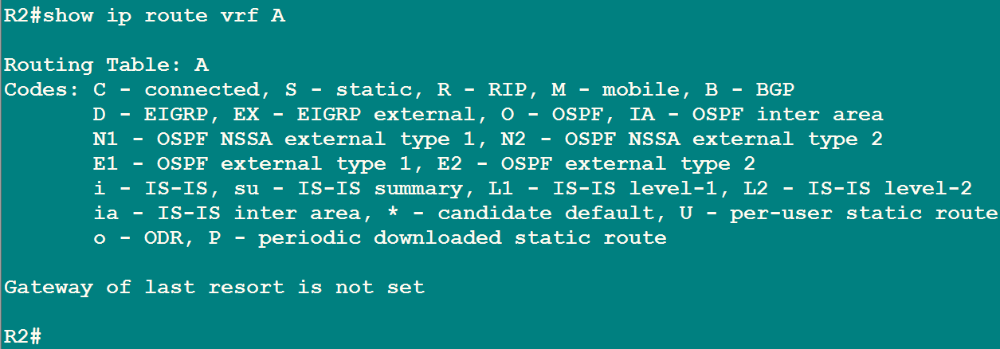 | 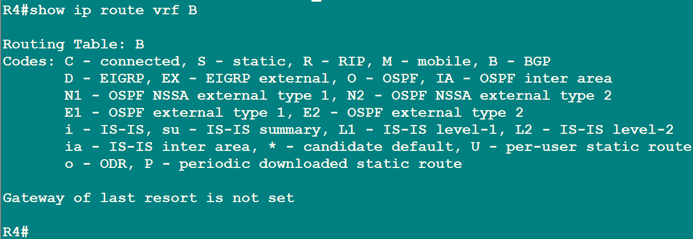 |

## Step 5.4: assign the VRFs to interfaces

**Goal:** move the customer facing port of each PE into its VRF.

```
R2(config)#interface Serial1/0
R2(config-if)#ip vrf forwarding A
% Interface Serial1/0 IP address 1.1.1.2 removed due to enabling VRF A
R2(config-if)#ip address 1.1.1.2 255.0.0.0
R2(config-if)#exit

R4(config)#interface Serial1/1
R4(config-if)#ip vrf forwarding B
% Interface Serial1/1 IP address 4.1.1.1 removed due to enabling VRF B
R4(config-if)#ip address 4.1.1.1 255.0.0.0
R4(config-if)#exit
```

The warning is normal. Type the address again after the VRF command.

**Result:** network 1.0.0.0/8 left R2's global table and now lives in VRF A. The same happened to 4.0.0.0/8 on R4 and VRF B.

| Screenshot | What it proves |
|-----------|----------------|
| 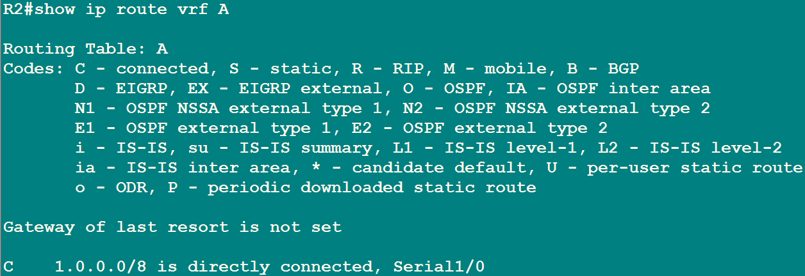 | VRF A now holds 1.0.0.0/8 |
| 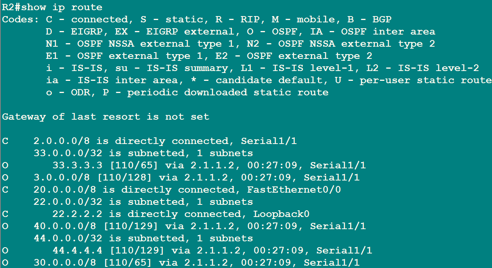 | R2's global table no longer holds 1.0.0.0/8 |
| 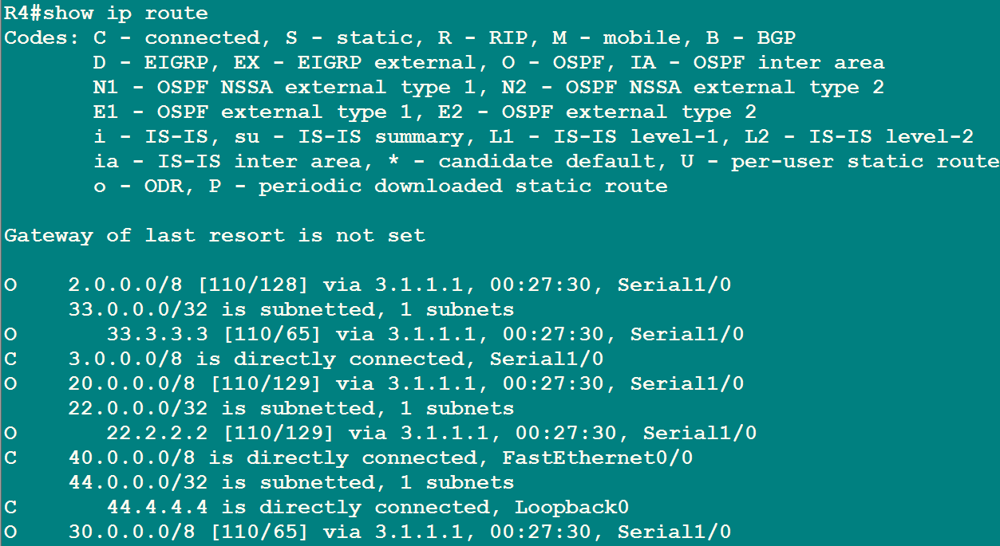 | R4's global table no longer holds 4.0.0.0/8 |
| 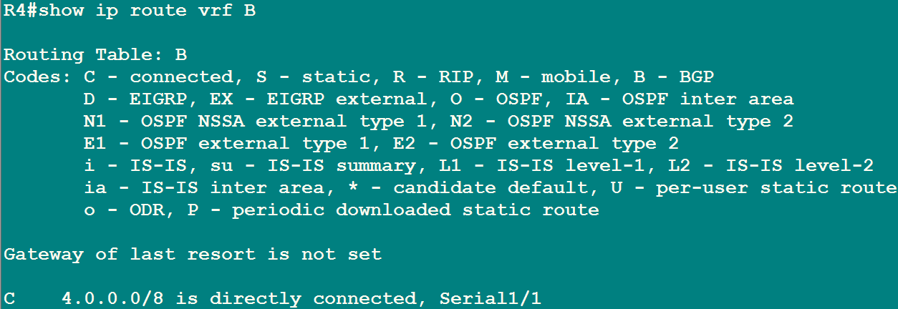 | VRF B now holds 4.0.0.0/8 |

**Ping experiments** (this is the best way to feel what a VRF does):

| Test | Result | Why |
|------|--------|-----|
| `R1#ping 1.1.1.2` | 100 percent | R1's table has 1.0.0.0/8 and R2 answers |
| `R2#ping 1.1.1.1` | **0 percent** | R2's global table has no 1.0.0.0/8. The route is in VRF A |
| `R2#ping vrf A 1.1.1.1` | 100 percent | The ping now searches inside VRF A |
| `R5#ping 4.1.1.1` | 100 percent | Same as the first test on the Branch side |
| `R4#ping 4.1.1.2` | **0 percent** | Route is in VRF B, not the global table |
| `R4#ping vrf B 4.1.1.2` | 100 percent | The ping now searches inside VRF B |

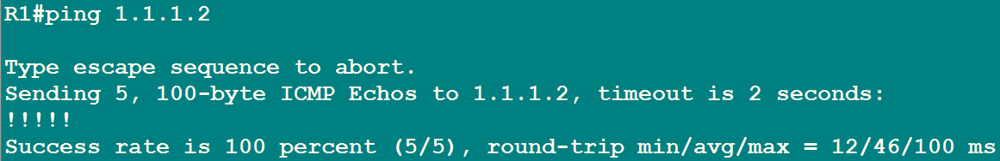
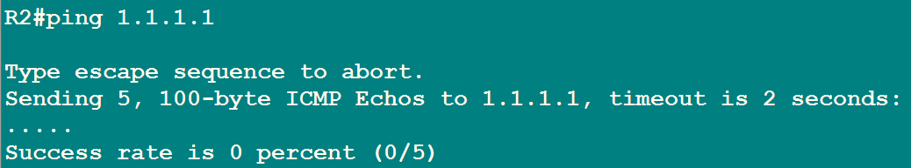
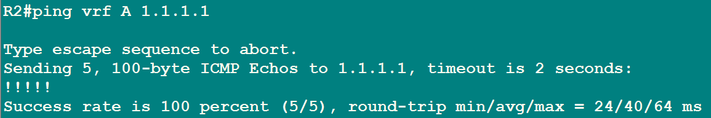
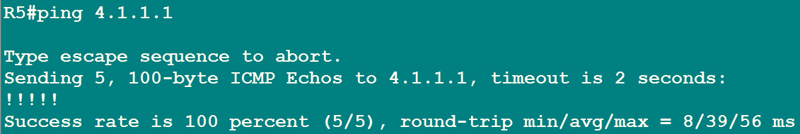
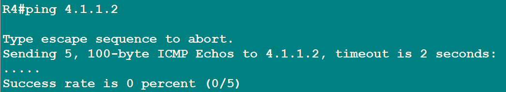
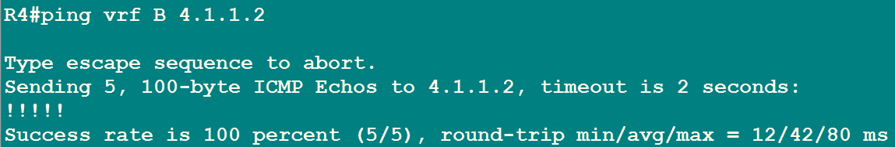

## Step 5.5: OSPF 10 on the customer ends

**Goal:** let each PE learn its customer's routes. The customer router runs normal OSPF 10. The PE runs OSPF 10 **inside the VRF** by adding `vrf A` (or `vrf B`).

**HBL Head Office**
```
R1(config)#router ospf 10
R1(config-router)#network 1.0.0.0 0.255.255.255 area 0
R1(config-router)#network 11.0.0.0 0.255.255.255 area 0
R1(config-router)#network 10.0.0.0 0.255.255.255 area 0
R1(config-router)#exit

R2(config)#router ospf 10 vrf A
R2(config-router)#network 1.0.0.0 0.255.255.255 area 0
R2(config-router)#exit
*%OSPF-5-ADJCHG: Process 10, Nbr 11.1.1.1 on Serial1/0 from LOADING to FULL
```

**HBL Branch**
```
R5(config)#router ospf 10
R5(config-router)#network 4.0.0.0 0.255.255.255 area 0
R5(config-router)#network 55.5.5.5 0.0.0.0 area 0
R5(config-router)#network 50.0.0.0 0.255.255.255 area 0
R5(config-router)#exit

R4(config)#router ospf 10 vrf B
R4(config-router)#network 4.0.0.0 0.255.255.255 area 0
R4(config-router)#exit
*%OSPF-5-ADJCHG: Process 10, Nbr 55.5.5.5 on Serial1/1 from LOADING to FULL
```

**Result:**

| Screenshot | What to notice |
|-----------|----------------|
| 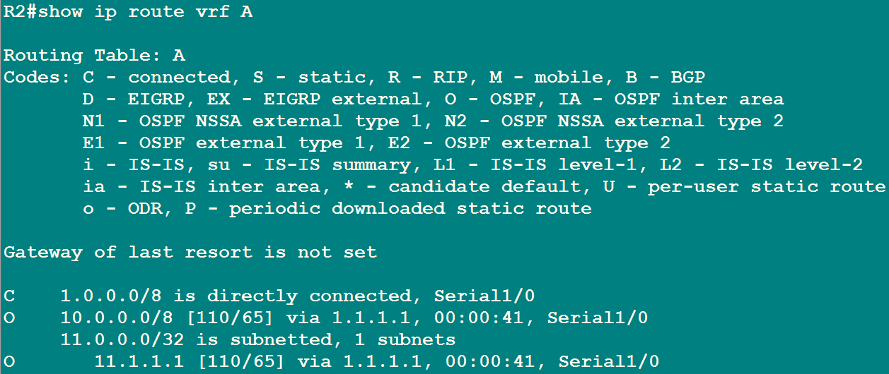 | VRF A on R2 learned 10.0.0.0/8 and 11.1.1.1/32 from R1 |
| 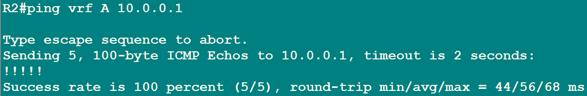 | `ping vrf A 10.0.0.1` works |
| 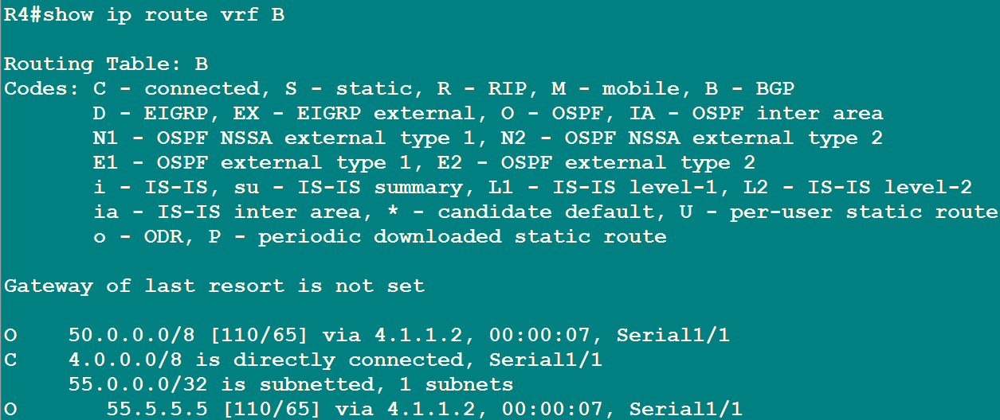 | VRF B on R4 learned 50.0.0.0/8 and 55.5.5.5/32 from R5 |
| 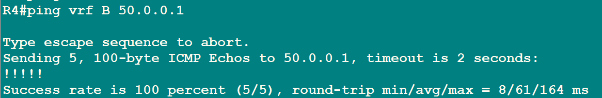 | `ping vrf B 50.0.0.1` works |

## Step 5.6: MP-BGP between the PEs

**Goal:** build the road that carries customer routes across the core. Only R2 and R4 run BGP. R3 does not.

```
R2(config)#router bgp 10
R2(config-router)#no auto-summary
R2(config-router)#no synchronization
R2(config-router)#neighbor 44.4.4.4 remote-as 10
R2(config-router)#neighbor 44.4.4.4 update-source Loopback0
R2(config-router)#address-family vpnv4
R2(config-router-af)#neighbor 44.4.4.4 activate
R2(config-router-af)#neighbor 44.4.4.4 send-community extended
R2(config-router-af)#exit-address-family

R4(config)#router bgp 10
R4(config-router)#no auto-summary
R4(config-router)#no synchronization
R4(config-router)#neighbor 22.2.2.2 remote-as 10
R4(config-router)#neighbor 22.2.2.2 update-source Loopback0
*%BGP-5-ADJCHANGE: neighbor 22.2.2.2 Up
R4(config-router)#address-family vpnv4
R4(config-router-af)#neighbor 22.2.2.2 activate
R4(config-router-af)#neighbor 22.2.2.2 send-community extended
*%BGP-5-ADJCHANGE: neighbor 22.2.2.2 Down Address family activated
*%BGP-5-ADJCHANGE: neighbor 22.2.2.2 Up
R4(config-router-af)#exit-address-family
```

The short Down then Up is normal. The session restarts when the VPNv4 address family is activated.

| Command | Plain English |
|---------|---------------|
| `neighbor x remote-as 10` | Same AS number as mine, so this is iBGP |
| `neighbor x update-source Loopback0` | Talk from my loopback, not from a cable address |
| `address-family vpnv4` | Enter the section that carries VPN routes |
| `neighbor x activate` | Turn on VPNv4 exchange with this neighbour |
| `neighbor x send-community extended` | Send the route-target tags along with the routes |

**Result:** `show ip bgp summary`

| R2 | R4 |
|----|----|
| 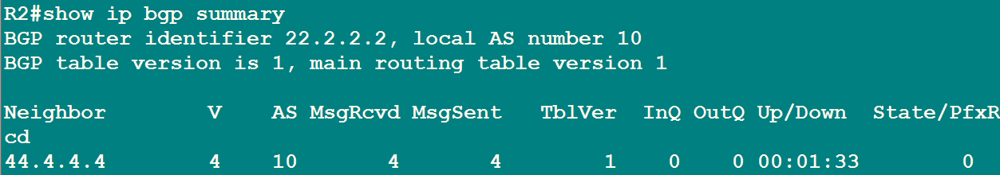 | 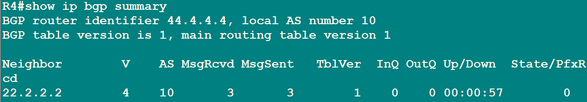 |

Both show one neighbour (the other PE's loopback), AS 10, with an Up/Down time counting up. `State/PfxRcd` shows 0 because no VPN routes have been placed into BGP yet. That is the next step.

## Step 5.7: redistribute OSPF 10 into BGP 10

**Goal:** copy each customer's OSPF routes into BGP so they can cross the core. This is done **inside the VRF address family**.

```
R2(config)#router bgp 10
R2(config-router)#address-family ipv4 vrf A
R2(config-router-af)#redistribute ospf 10 match internal external 1 external 2
R2(config-router-af)#exit-address-family

R4(config)#router bgp 10
R4(config-router)#address-family ipv4 vrf B
R4(config-router-af)#redistribute ospf 10 match internal external 1 external 2
R4(config-router-af)#exit-address-family
```

`match internal external 1 external 2` means "take every kind of OSPF route": internal ones plus both external types.

**Result:** `show ip bgp vpnv4 all`

| R2 | R4 |
|----|----|
| 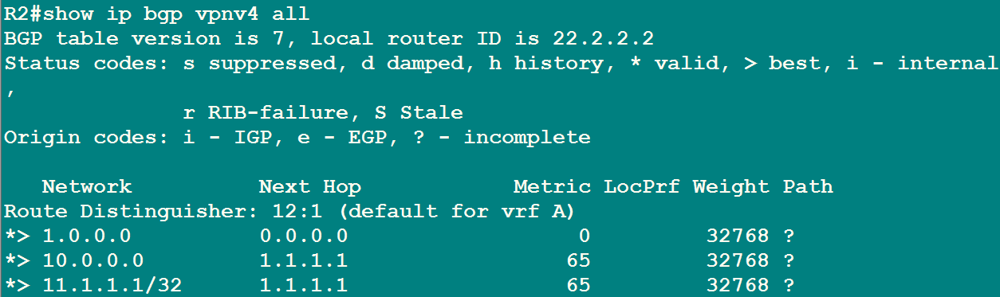 | 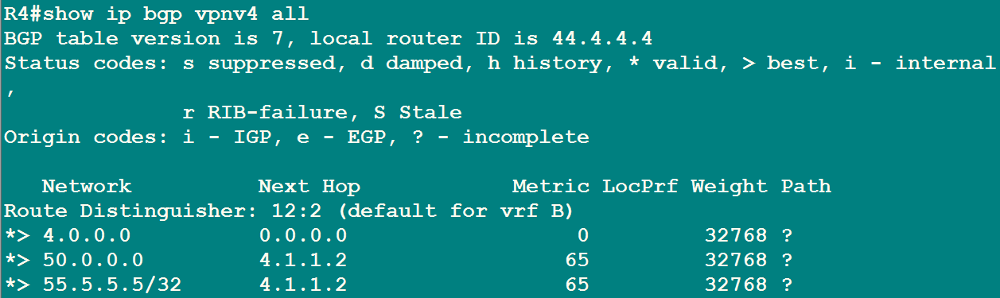 |

Each PE now holds only its **own** customer's routes, listed under its own RD (12:1 on R2, 12:2 on R4). Nothing has crossed yet.

## Step 5.8: import the other site's route-target

**Goal:** make each VRF accept the other customer site's tag. Until now each VRF accepted only its own tag, so BGP routes had nowhere to land.

```
R2(config)#ip vrf A
R2(config-vrf)#route-target import 1:2
R2(config-vrf)#exit

R4(config)#ip vrf B
R4(config-vrf)#route-target import 1:1
R4(config-vrf)#exit
```

**Result:**

| Screenshot | What to notice |
|-----------|----------------|
| 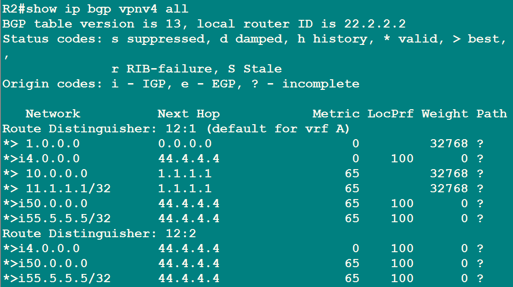 | R2 now holds 4.0.0.0, 50.0.0.0 and 55.5.5.5/32 with next hop 44.4.4.4 (the `i` means learned by iBGP) |
| 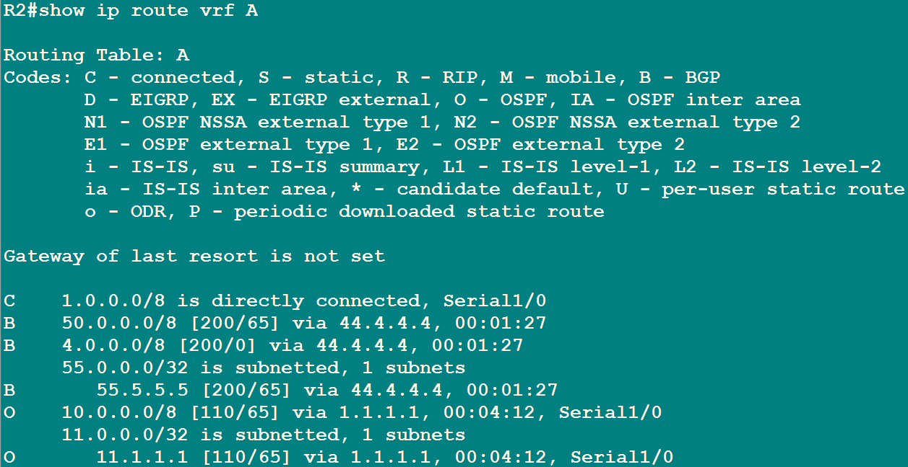 | VRF A on R2 shows those routes as `B` (BGP), with 200 as the administrative distance |
| 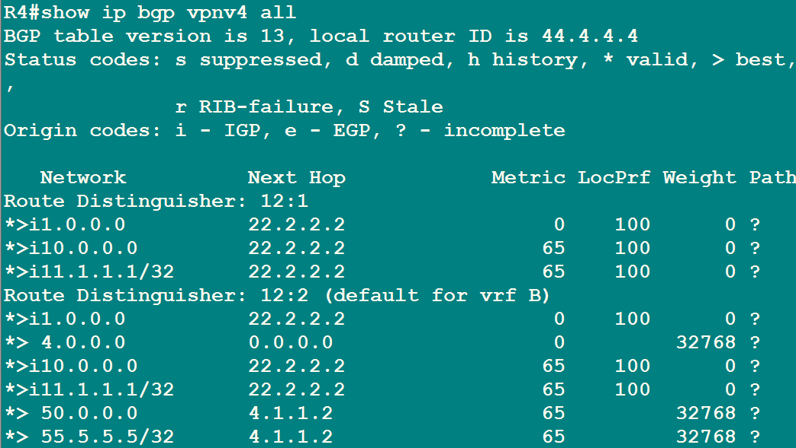 | R4 holds 1.0.0.0, 10.0.0.0 and 11.1.1.1/32 with next hop 22.2.2.2 |
| 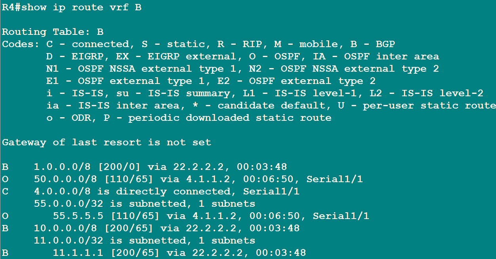 | VRF B on R4 shows them as `B` routes |

## Step 5.9: redistribute BGP 10 into OSPF 10

**Goal:** hand the far site's routes to the local customer router. Without this the PEs know everything, but R1 and R5 still know only their own side.

```
R2(config)#router ospf 10 vrf A
R2(config-router)#redistribute bgp 10 subnets
R2(config-router)#exit

R4(config)#router ospf 10 vrf B
R4(config-router)#redistribute bgp 10 subnets
R4(config-router)#exit
```

`subnets` is important. Without it, OSPF redistributes only classful networks, and subnetted routes such as the /32 loopbacks are left out.

**Result:**

| Screenshot | What to notice |
|-----------|----------------|
| 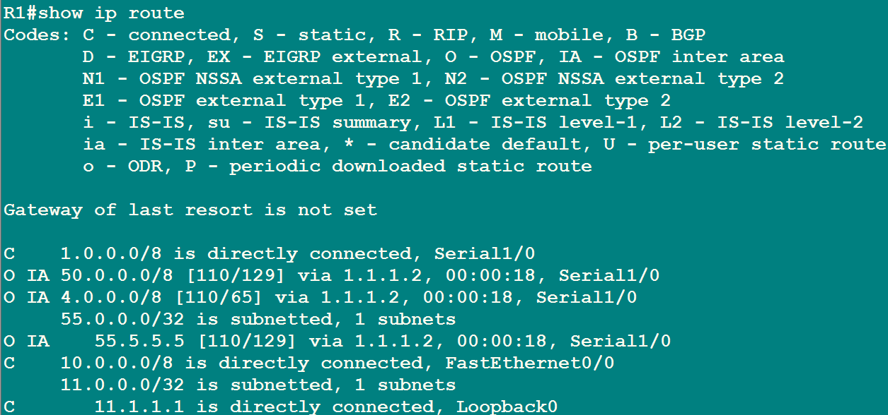 | R1 shows 4.0.0.0/8, 50.0.0.0/8 and 55.5.5.5/32 as `O IA` via 1.1.1.2 |
| 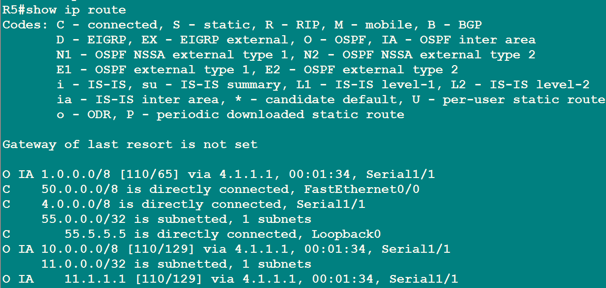 | R5 shows 1.0.0.0/8, 10.0.0.0/8 and 11.1.1.1/32 as `O IA` via 4.1.1.1 |
| 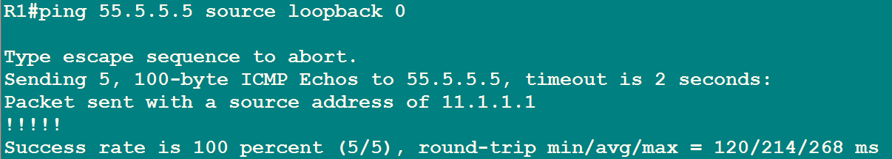 | Head Office reaches the Branch loopback: `ping 55.5.5.5 source Loopback0` gives 100 percent |
| 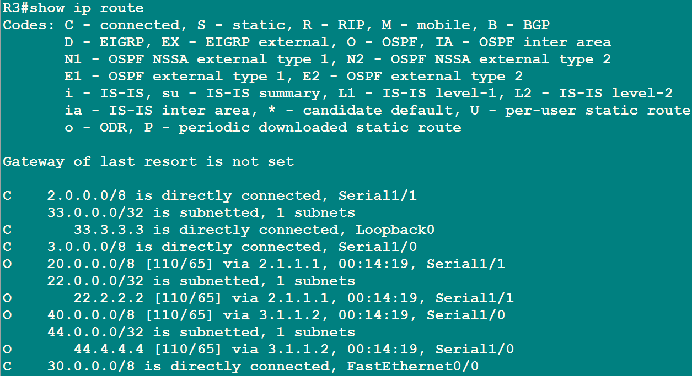 | The P router R3 holds **not one** customer route |

Why `O IA` (inter-area) and not `O E2`? Both PEs use OSPF process number 10, which gives them the same OSPF domain ID. IOS treats the two sites as parts of one OSPF network, and the routes that come across the provider look like inter-area routes.

## Step 5.10: verification

The full trace of one packet from R1 to 55.5.5.5, with every label, is in [`04-verification.md`](04-verification.md).
