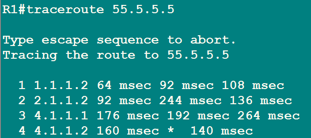
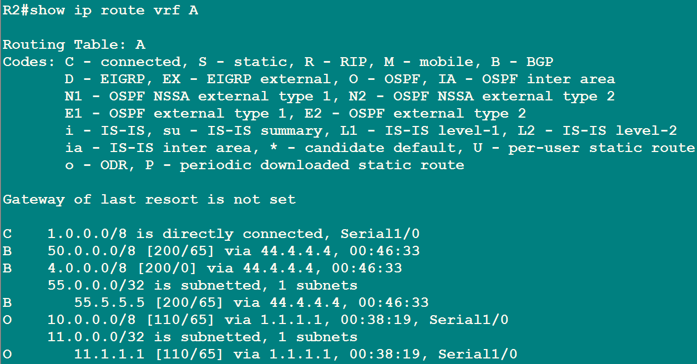
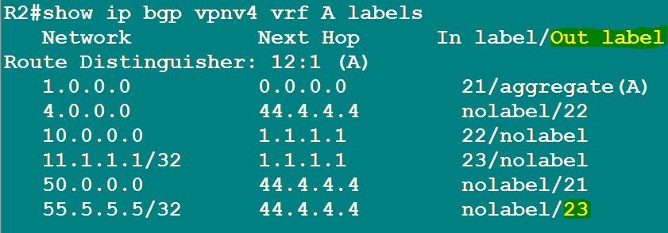
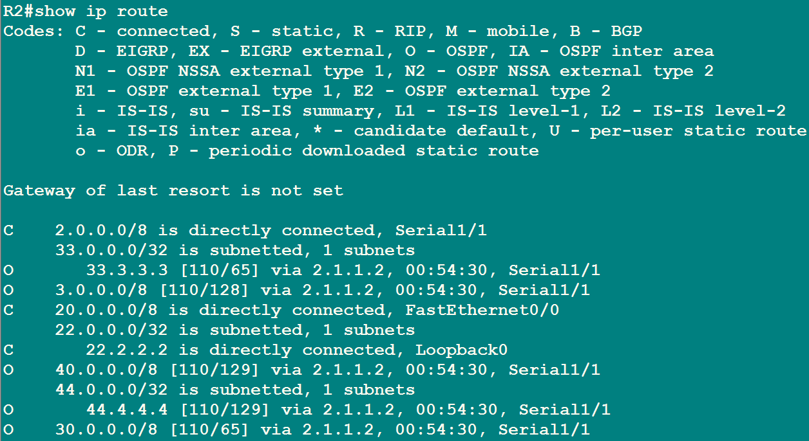
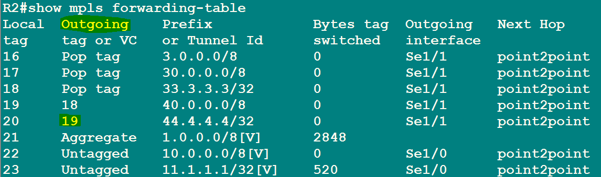
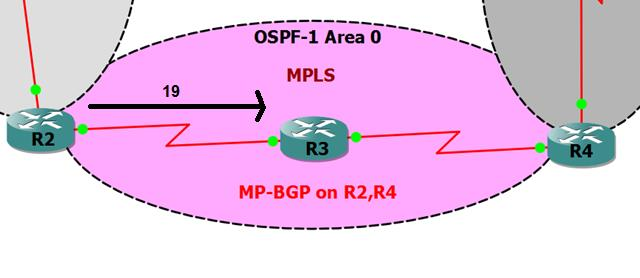
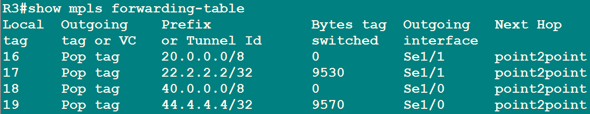
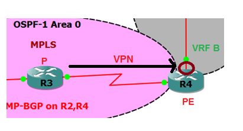
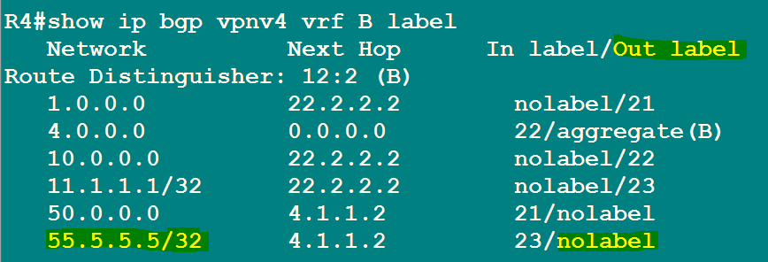
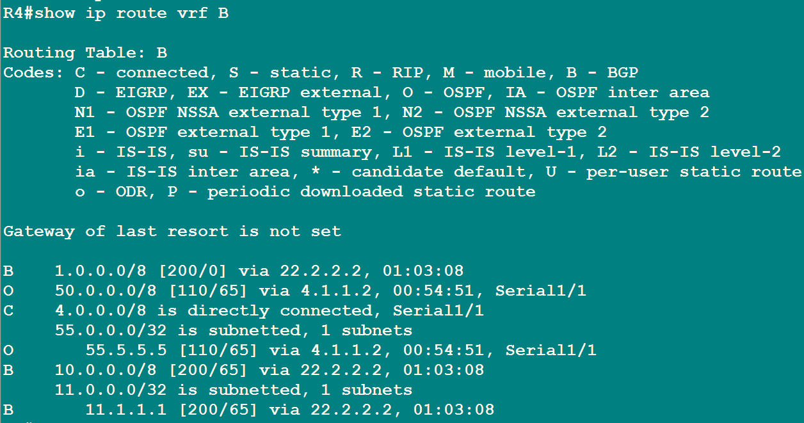

# 4. Verification: tracing one packet

This page follows a single ping from **R1** to **55.5.5.5** (the Branch loopback) all the way through the network, label by label. It is the same trace as step 5.10 of the lab.

```
R1#traceroute 55.5.5.5
```


Four hops: 1.1.1.2 (R2), 2.1.1.2 (R3), 4.1.1.1 (R4), then 4.1.1.2 (R5) replying. That already tells us the path. Now the "why" behind each hop.

## Hop 1: R1 looks up its own table

```
R1#show ip route
```


Network 55.5.5.5/32 is present (learned from OSPF 10 in step 5.9), next hop 1.1.1.2. R1 sends a plain, unlabeled IP packet to R2.

| IP packet |
|-----------|
| dst 55.5.5.5 |

## Hop 2: R2 finds the VPN label

The packet arrives on R2's Serial1/0, which lives in VRF A. R2 looks the destination up **inside VRF A**.

```
R2#show ip route vrf A
```


The route points at next hop 44.4.4.4 (R4's loopback), which is a BGP route. R2 now needs the VPN label BGP attached to it.

```
R2#show ip bgp vpnv4 vrf A labels
```


For 55.5.5.5/32 the **out label is 23**. R2 wraps the packet with VPN label 23.

| VPN label | IP packet |
|-----------|-----------|
| 23 | 55.5.5.5 |

## Hop 3: R2 finds the MPLS label to reach R4

The next hop 44.4.4.4 is not directly connected. It is reached across the MPLS core, so R2 looks it up in its **global** table and then the LFIB.

```
R2#show ip route
```


44.4.4.4/32 is reachable via 2.1.1.2 (R3), learned by OSPF 1.

```
R2#show mpls forwarding-table
```


For 44.4.4.4/32 the outgoing (MPLS) label is **19**. R2 adds that label on top of the VPN label and sends the packet to R3.

| MPLS label | VPN label | IP packet |
|-----------|-----------|-----------|
| 19 | 23 | 55.5.5.5 |



## Hop 4: R3 pops the MPLS label

R3 is a plain P router. It never reads the VPN label, it only swaps or removes the MPLS label.

```
R3#show mpls forwarding-table
```


R3's local label 19 has action **Pop tag**, next hop 44.4.4.4 (out its Serial1/0 to R4). Popping means "remove this label and send what's underneath". This is Penultimate Hop Popping: the second to last router does the popping so the last router (R4) has less work.

| VPN label | IP packet |
|-----------|-----------|
| 23 | 55.5.5.5 |



## Hop 5: R4 removes the VPN label and delivers

R4 receives a packet carrying only the VPN label 23.

```
R4#show ip bgp vpnv4 vrf B label
```


Local label 23 belongs to 55.5.5.5/32 in VRF B. R4 removes the label. The bare IP packet is left.

| IP packet |
|-----------|
| 55.5.5.5 |

```
R4#show ip route vrf B
```


VRF B shows 55.5.5.5/32 is directly connected out Serial1/1. R4 delivers the packet to R5.

## Summary table

| Hop | Router | What it read | What it did |
|-----|--------|--------------|-------------|
| 1 | R1 | Global route to 55.5.5.5 | Sent plain IP to R2 |
| 2 | R2 | VRF A route, then BGP label | Added VPN label 23 |
| 3 | R2 | Global route, then LFIB | Added MPLS label 19, sent to R3 |
| 4 | R3 | LFIB only, no VPN label ever read | Popped label 19, sent to R4 |
| 5 | R4 | VPN label 23, then VRF B route | Removed label 23, delivered to R5 |

This proves the whole design: **R3 never touched a customer address**, and the two customer sites reached each other only because their route-targets matched.

## Full end to end checklist

Run these after step 5.9 to confirm the lab works, in this order:

```
R1#show ip interface brief
R2#show ip interface brief
R3#show ip interface brief
R4#show ip interface brief
R5#show ip interface brief

R2#show mpls ldp neighbor
R4#show mpls ldp neighbor

R2#show ip bgp summary
R4#show ip bgp summary

R2#show ip route vrf A
R4#show ip route vrf B

R1#ping 55.5.5.5 source Loopback0
R5#ping 11.1.1.1 source Loopback0

R1#traceroute 55.5.5.5
R5#traceroute 11.1.1.1
```

Expected: every interface up/up, two LDP neighbours, one BGP neighbour each with an Up state, VRF routes with both `O` (local OSPF) and `B` (from the far site) entries, and both pings at 100 percent.
